# Yield Aggregator - Complete Project Documentation

## Table of Contents
1. [Project Overview](#project-overview)
2. [Architecture](#architecture)
3. [Smart Contracts](#smart-contracts)
4. [Frontend Application](#frontend-application)
5. [Setup & Deployment](#setup--deployment)
6. [Testing Guide](#testing-guide)
7. [Technical Deep Dive](#technical-deep-dive)

---

## Project Overview

### What is This Project?

This is a **DeFi Yield Aggregator** - a decentralized finance application that allows users to:
- **Lend ETH** and earn yield from investment strategies
- **Borrow WETH** (Wrapped ETH) with a fee
- **Automatically invest** deposits into yield-generating strategies
- **Track performance** through a modern web dashboard

Think of it like a decentralized bank where:
- Lenders deposit money and earn interest
- Borrowers take loans and pay fees
- The system automatically invests idle funds to maximize returns

### Key Features

| Feature | Description |
|---------|-------------|
| 🏦 **Vault System** | Secure smart contract that holds user deposits |
| 📈 **Yield Strategies** | Automated investment strategies (currently using MockStrategy for testing) |
| 💰 **Lending** | Deposit ETH, receive shares representing your ownership |
| 💸 **Borrowing** | Borrow WETH with a 10% fee |
| 🌾 **Yield Harvesting** | Simulate earning 5% yield on invested funds |
| 🎨 **Modern UI** | Beautiful glassmorphism design with real-time updates |

### Technology Stack

```
┌─────────────────────────────────────────┐
│           Frontend (React)              │
│  - React + TypeScript + Vite            │
│  - Ethers.js for blockchain interaction │
│  - Recharts for data visualization      │
└─────────────────────────────────────────┘
                    ↕
┌─────────────────────────────────────────┐
│        Blockchain (Sepolia)             │
│  - Vault.sol (Main contract)            │
│  - MockStrategy.sol (Investment logic)  │
│  - WETH (Wrapped ETH token)             │
└─────────────────────────────────────────┘
```

---

## Architecture

### System Architecture Diagram

```mermaid
graph TB
    User[👤 User Wallet]
    Frontend[🖥️ React Frontend]
    Vault[🏦 Vault Contract]
    Strategy[📈 MockStrategy Contract]
    WETH[💎 WETH Contract]
    
    User -->|Connect MetaMask| Frontend
    Frontend -->|Deposit ETH| Vault
    Frontend -->|Borrow/Repay| Vault
    Frontend -->|Read Balance| Vault
    
    Vault -->|90% of deposits| Strategy
    Vault -->|Withdraw funds| Strategy
    Vault -->|Wrap/Unwrap| WETH
    
    Strategy -->|Invest| WETH
    Strategy -->|Harvest Yield| Strategy
    Strategy -->|Return funds| Vault
    
    style User fill:#e1f5ff
    style Frontend fill:#fff4e1
    style Vault fill:#e8f5e9
    style Strategy fill:#f3e5f5
    style WETH fill:#fce4ec
```



### Data Flow

#### 1. Deposit Flow
```
User sends ETH → Vault wraps to WETH → 90% sent to Strategy → User receives shares
```

#### 2. Borrow Flow
```
User requests WETH → Vault checks liquidity → Pulls from Strategy if needed → Transfers WETH to user
```

#### 3. Harvest Flow
```
Admin triggers harvest → Strategy calculates 5% yield → Balance increases (if funded) → Total assets grow
```

#### 4. Withdraw Flow
```
User burns shares → Vault calculates ETH amount → Pulls from Strategy if needed → Unwraps WETH → Sends ETH to user
```

---

## Smart Contracts

### Contract Overview

| Contract | Purpose | Key Functions |
|----------|---------|---------------|
| **Vault.sol** | Main vault managing deposits, withdrawals, and borrowing | `deposit()`, `withdraw()`, `borrow()`, `repay()` |
| **MockStrategy.sol** | Investment strategy (simulates yield generation) | `deposit()`, `withdraw()`, `harvest()` |
| **WETH** | Wrapped ETH token (standard ERC20) | `deposit()`, `withdraw()`, `transfer()` |

### Vault.sol - Deep Dive

**Location**: [`contracts/Vault.sol`](file:///Users/forge/Forge/try-2/contracts/Vault.sol)

#### State Variables
```solidity
IWETH public immutable weth;              // WETH token contract
IStrategy public strategy;                 // Current investment strategy
mapping(address => uint256) public shares; // User share balances
uint256 public totalShares;                // Total shares issued
mapping(address => uint256) public borrowed; // User debt tracking
uint256 public totalBorrowed;              // Total debt across all users
```

#### Core Functions

##### `deposit()` - Lend ETH
```solidity
function deposit() external payable
```
**What it does**:
1. Accepts ETH from user
2. Wraps ETH to WETH
3. Calculates shares based on current total assets
4. Sends 90% to strategy, keeps 10% as buffer
5. Issues shares to user

**Example**:
```javascript
// Deposit 0.01 ETH
await vault.deposit({ value: parseEther("0.01") });
```

##### `withdraw(uint256 shareAmount)` - Redeem Shares
```solidity
function withdraw(uint256 shareAmount) external
```
**What it does**:
1. Burns user's shares
2. Calculates ETH amount based on share percentage
3. Pulls funds from strategy if vault doesn't have enough
4. Unwraps WETH to ETH
5. Sends ETH to user

**Example**:
```javascript
// Withdraw all shares
const shares = await vault.balanceOf(userAddress);
await vault.withdraw(shares);
```

##### `borrow(uint256 amount)` - Borrow WETH
```solidity
function borrow(uint256 amount) external
```
**What it does**:
1. Checks available liquidity
2. Pulls from strategy if needed
3. Adds 10% fee to user's debt
4. Transfers WETH to borrower

**Fee Structure**: 10% upfront fee
- Borrow 1 WETH → Owe 1.1 WETH

**Example**:
```javascript
// Borrow 0.003 WETH (will owe 0.0033 WETH)
await vault.borrow(parseEther("0.003"));
```

##### `repay(uint256 amount)` - Repay Debt
```solidity
function repay(uint256 amount) external
```
**What it does**:
1. Transfers WETH from user to vault (requires approval)
2. Reduces user's debt
3. Reduces total borrowed amount

**Example**:
```javascript
// First approve WETH spending
await weth.approve(vaultAddress, parseEther("0.0033"));
// Then repay
await vault.repay(parseEther("0.0033"));
```

##### `totalAssets()` - Calculate Total Value
```solidity
function totalAssets() public view returns (uint256)
```
**Formula**:
```
Total Assets = Vault WETH Balance + Total Borrowed + Strategy Balance
```

This represents the total value locked in the system.

---

### MockStrategy.sol - Deep Dive

**Location**: [`contracts/MockStrategy.sol`](file:///Users/forge/Forge/try-2/contracts/MockStrategy.sol)

#### Purpose
Simulates a real yield-generating strategy (like Aave, Compound, etc.) for testing purposes.

#### State Variables
```solidity
IWETH public immutable weth;  // WETH token contract
uint256 public totalBalance;   // Tracked balance (accounting)
```

#### Core Functions

##### `deposit()` - Receive Funds
```solidity
function deposit() external payable override
```
**What it does**:
1. Receives ETH from vault
2. Wraps to WETH
3. Increases `totalBalance` tracking

##### `withdraw(uint256 amount)` - Return Funds
```solidity
function withdraw(uint256 amount) external override
```
**What it does**:
1. Checks sufficient balance
2. Unwraps WETH to ETH
3. Sends ETH back to vault
4. Decreases `totalBalance`

**Critical Fix**: The `receive()` function checks if ETH comes from WETH unwrapping to avoid circular wrap/unwrap.

##### `harvest()` - Generate Yield
```solidity
function harvest() external override
```
**What it does**:
1. Calculates 5% yield on current balance
2. Checks if strategy has enough WETH to back the increase
3. Only increases `totalBalance` if backed by real WETH

**Why the check?**: Prevents phantom balance that would cause withdrawal failures.

**Example**:
```javascript
// Harvest 5% yield (requires funding reward pool first)
await strategy.harvest();
```

##### `receive()` - Accept ETH
```solidity
receive() external payable
```
**What it does**:
- Wraps incoming ETH to WETH (for funding reward pool)
- **Skips wrapping** if ETH comes from WETH contract (prevents circular wrap/unwrap)

---

## Frontend Application

### Technology Stack

```
React 18 + TypeScript
├── Vite (Build tool)
├── Ethers.js v6 (Blockchain interaction)
├── Recharts (Charts & visualization)
└── CSS (Glassmorphism styling)
```

### File Structure

```
frontend/
├── src/
│   ├── App.tsx          # Main application component
│   ├── App.css          # Glassmorphism styles
│   ├── main.tsx         # Entry point
│   └── vite-env.d.ts    # TypeScript definitions
├── index.html           # HTML template
├── package.json         # Dependencies
└── vite.config.ts       # Vite configuration
```

### App.tsx - Component Breakdown

**Location**: [`frontend/src/App.tsx`](file:///Users/forge/Forge/try-2/frontend/src/App.tsx)

#### State Management

```typescript
// Blockchain connection
const [account, setAccount] = useState<string | null>(null);
const [provider, setProvider] = useState<ethers.BrowserProvider | null>(null);
const [vault, setVault] = useState<ethers.Contract | null>(null);

// Vault statistics
const [totalAssets, setTotalAssets] = useState<bigint>(0n);
const [totalBorrowed, setTotalBorrowed] = useState<bigint>(0n);
const [strategyBalance, setStrategyBalance] = useState<bigint>(0n);

// User balances
const [shares, setShares] = useState<bigint>(0n);
const [borrowed, setBorrowed] = useState<bigint>(0n);
const [ethBalance, setEthBalance] = useState<bigint>(0n);
```

#### Key Functions

##### `connectWallet()` - MetaMask Connection
```typescript
const connectWallet = async () => {
  const accounts = await provider.send("eth_requestAccounts", []);
  setAccount(accounts[0]);
}
```

##### `fetchData()` - Update UI State
```typescript
const fetchData = async (v: Contract, w: Contract, st: Contract | null, address: string) => {
  // Fetch all vault and user data
  // Update state variables
  // Refresh UI
}
```

##### `handleTx()` - Transaction Handler
```typescript
const handleTx = async (action: () => Promise<ContractTransactionResponse>) => {
  setIsPending(true);           // Show "Pending..." status
  const tx = await action();     // Execute transaction
  setIsConfirming(true);         // Show "Confirming..." status
  await tx.wait();               // Wait for confirmation
  setIsConfirmed(true);          // Show "Confirmed!" status
  fetchData(...);                // Refresh data
}
```

#### UI Components

##### 1. Header Section
- Wallet connection button
- Connected address display

##### 2. Vault Health Card
- Pie chart showing asset distribution (Borrowed / Strategy / Idle)
- Total assets, strategy balance, idle liquidity
- Harvest and fund reward pool buttons

##### 3. Lender Actions Card
- User shares display
- Wallet ETH balance
- Deposit input and button
- Withdraw all shares button

##### 4. Borrower Actions Card
- User debt display
- Wallet WETH balance
- Borrow input and button
- Repay input and button

##### 5. Transaction Status
- Fixed position notification
- Shows pending/confirming/confirmed states

### Styling - Glassmorphism Design

**Location**: [`frontend/src/App.css`](file:///Users/forge/Forge/try-2/frontend/src/App.css)

Key design elements:
- **Glass effect**: `backdrop-filter: blur(10px)` with semi-transparent backgrounds
- **Gradients**: Vibrant color gradients for visual appeal
- **Animations**: Smooth hover effects and transitions
- **Dark theme**: Professional dark background with light text

---

## Setup & Deployment

### Prerequisites

```bash
# Required software
Node.js >= 18.x
npm >= 9.x
MetaMask browser extension

# Required accounts
Sepolia testnet account with ETH
Alchemy or Infura RPC endpoint
```

### Installation Steps

#### 1. Clone & Install
```bash
# Navigate to project directory
cd /Users/forge/Forge/try-2

# Install root dependencies
npm install

# Install frontend dependencies
cd frontend
npm install
cd ..
```

#### 2. Environment Configuration
Create `.env` file in project root:
```env
SEPOLIA_RPC_URL=https://eth-sepolia.g.alchemy.com/v2/YOUR_API_KEY
PRIVATE_KEY=your_private_key_without_0x_prefix
```

> [!WARNING]
> Never commit your `.env` file! It contains sensitive credentials.

#### 3. Compile Contracts
```bash
npx ts-node scripts/compile.ts
```

**Output**: Creates `artifacts/` directory with compiled contract ABIs and bytecode.

#### 4. Deploy to Sepolia
```bash
npx ts-node scripts/deploy.ts
```

**What happens**:
1. Deploys `Vault.sol`
2. Deploys `MockStrategy.sol`
3. Links strategy to vault
4. Saves addresses to `deployments.json`

**Expected output**:
```
Deploying from: 0x...
Vault deployed at: 0x30Cd4faC30d1E4b73b8179aab4fBc009C907E024
MockStrategy deployed at: 0xeE8F07acFCaFd0273d2F67771edaCA7D70C6a360
Strategy set successfully.
```

#### 5. Update Frontend
The vault address is already updated in [`App.tsx`](file:///Users/forge/Forge/try-2/frontend/src/App.tsx#L7):
```typescript
const VAULT_ADDRESS = "0x30Cd4faC30d1E4b73b8179aab4fBc009C907E024";
```

#### 6. Run Frontend
```bash
cd frontend
npm run dev
```

**Access**: Open `http://localhost:5173` in your browser

---

## Testing Guide

### Complete Testing Workflow

See [`testing_guide.md`](file:///Users/forge/.gemini/antigravity/brain/ee1b9731-d443-4a13-92f1-bd44787667fa/testing_guide.md) for detailed step-by-step instructions.

### Quick Test Summary

```
1. Connect Wallet (MetaMask on Sepolia)
2. Deposit 0.01 ETH → Receive shares
3. Fund Reward Pool (0.01 ETH) → Enable yield
4. Harvest Yield → Earn 5% profit
5. Borrow 0.003 WETH → Receive WETH, owe 0.0033
6. Repay 0.0033 WETH → Clear debt
7. Withdraw All Shares → Receive ETH + earned yield
```

### Debug Scripts

Located in [`scripts/`](file:///Users/forge/Forge/try-2/scripts):

```bash
# Check vault state
npx ts-node scripts/debug_vault.ts

# Check strategy balances
npx ts-node scripts/debug_borrow.ts

# Test borrow functionality
npx ts-node scripts/test_borrow.ts
```

---

## Technical Deep Dive

### Share Calculation

When depositing, shares are calculated proportionally:

```solidity
if (totalShares == 0 || totalAssets == 0) {
    // First deposit: 1:1 ratio
    shareIssuance = amount;
} else {
    // Subsequent deposits: proportional to existing shares
    shareIssuance = (amount * totalShares) / totalAssets;
}
```

**Example**:
- Total Assets: 10 ETH
- Total Shares: 10
- User deposits: 1 ETH
- Shares issued: (1 * 10) / 10 = 1 share

If yield is earned and total assets grow to 11 ETH:
- User deposits: 1 ETH
- Shares issued: (1 * 10) / 11 = 0.909 shares (user gets less shares because each share is worth more)

### Withdrawal Calculation

When withdrawing, ETH amount is calculated:

```solidity
uint256 amountToWithdraw = (shareAmount * totalAssets) / totalShares;
```

**Example**:
- User shares: 1
- Total shares: 10
- Total assets: 11 ETH (after yield)
- Withdrawal amount: (1 * 11) / 10 = 1.1 ETH

User profits 0.1 ETH from yield!

### Liquidity Management

The vault maintains a 10% buffer:

```solidity
uint256 buffer = (totalAssets * 10) / 100; // 10% buffer

if (balance > buffer) {
    uint256 investAmount = balance - buffer;
    strategy.deposit{value: investAmount}();
}
```

**Why?**: Allows small withdrawals without pulling from strategy (saves gas).

### Critical Bug Fixes

See [`walkthrough.md`](file:///Users/forge/.gemini/antigravity/brain/ee1b9731-d443-4a13-92f1-bd44787667fa/walkthrough.md) for detailed bug analysis.

#### Bug #1: Phantom Balance
**Problem**: Harvest increased balance without backing WETH
**Fix**: Check actual WETH balance before increasing tracked balance

#### Bug #2: Circular Wrap/Unwrap
**Problem**: `receive()` wrapped all ETH, including from WETH unwrapping
**Fix**: Skip wrapping when `msg.sender == address(weth)`

---

## Project Structure

```
try-2/
├── contracts/              # Solidity smart contracts
│   ├── Vault.sol          # Main vault contract
│   ├── MockStrategy.sol   # Mock investment strategy
│   ├── IStrategy.sol      # Strategy interface
│   ├── IWETH.sol          # WETH interface
│   └── IERC20.sol         # ERC20 interface
│
├── scripts/               # Deployment & utility scripts
│   ├── compile.ts         # Compile contracts
│   ├── deploy.ts          # Deploy to Sepolia
│   ├── debug_vault.ts     # Debug vault state
│   └── test_borrow.ts     # Test borrow functionality
│
├── frontend/              # React application
│   ├── src/
│   │   ├── App.tsx        # Main component
│   │   ├── App.css        # Styles
│   │   └── main.tsx       # Entry point
│   ├── index.html         # HTML template
│   └── package.json       # Frontend dependencies
│
├── artifacts/             # Compiled contract artifacts
├── deployments.json       # Deployed contract addresses
├── .env                   # Environment variables (not in git)
├── package.json           # Root dependencies
└── README.md             # Basic setup instructions
```

---

## Future Enhancements

### Potential Improvements

1. **Real Strategies**: Integrate with Aave, Compound, Yearn
2. **Multiple Strategies**: Allow strategy migration and diversification
3. **Governance**: Add DAO voting for strategy changes
4. **Collateralization**: Require collateral for borrowing
5. **Interest Rates**: Dynamic interest based on utilization
6. **Liquidations**: Liquidate undercollateralized positions
7. **Mainnet Deployment**: Deploy to Ethereum mainnet (after audit!)

### Security Considerations

> [!CAUTION]
> This is a **learning project** and **NOT production-ready**. Before mainnet deployment:
> - Get professional smart contract audit
> - Add comprehensive test suite
> - Implement access controls
> - Add emergency pause functionality
> - Consider upgradeability patterns

---

## Resources

### Official Documentation
- [Ethers.js v6 Docs](https://docs.ethers.org/v6/)
- [React Documentation](https://react.dev/)
- [Solidity Documentation](https://docs.soliditylang.org/)

### Learning Resources
- [DeFi Yield Aggregators Explained](https://chain.link/education-hub/yield-aggregators)
- [How Aave Works](https://docs.aave.com/developers/)
- [WETH Explained](https://weth.io/)

### Project-Specific Docs
- [Testing Guide](file:///Users/forge/.gemini/antigravity/brain/ee1b9731-d443-4a13-92f1-bd44787667fa/testing_guide.md)
- [Bug Fixes Walkthrough](file:///Users/forge/.gemini/antigravity/brain/ee1b9731-d443-4a13-92f1-bd44787667fa/walkthrough.md)

---

## FAQ

### Q: Why use WETH instead of ETH?
**A**: WETH is an ERC20 token, making it easier to interact with DeFi protocols and track balances. ETH is wrapped to WETH for internal accounting, then unwrapped when withdrawing.

### Q: What's the difference between shares and ETH?
**A**: Shares represent ownership percentage in the vault. As the vault earns yield, each share becomes worth more ETH. Think of shares like stock in a company.

### Q: Why do I need to fund the reward pool?
**A**: The MockStrategy simulates yield but can't create ETH out of thin air. Funding the reward pool provides the WETH needed to back the simulated 5% yield increase.

### Q: Can I lose money?
**A**: In this test version, no - it's on Sepolia testnet with fake ETH. In a real version, yes - smart contract bugs, strategy losses, or market conditions could cause losses.

### Q: How is this different from a bank?
**A**: 
- **Decentralized**: No central authority
- **Transparent**: All code is open source
- **Permissionless**: Anyone can use it
- **Non-custodial**: You control your funds via private keys

---

## Contributing

This is a learning project! Feel free to:
- Fork and experiment
- Report bugs
- Suggest improvements
- Add features

---

## License

MIT License - See project for details

---

## Contact & Support

For questions or issues:
1. Check the [Testing Guide](file:///Users/forge/.gemini/antigravity/brain/ee1b9731-d443-4a13-92f1-bd44787667fa/testing_guide.md)
2. Review the [Bug Fixes Walkthrough](file:///Users/forge/.gemini/antigravity/brain/ee1b9731-d443-4a13-92f1-bd44787667fa/walkthrough.md)
3. Examine the smart contract code
4. Run debug scripts

---

**Happy Learning! 🚀**
